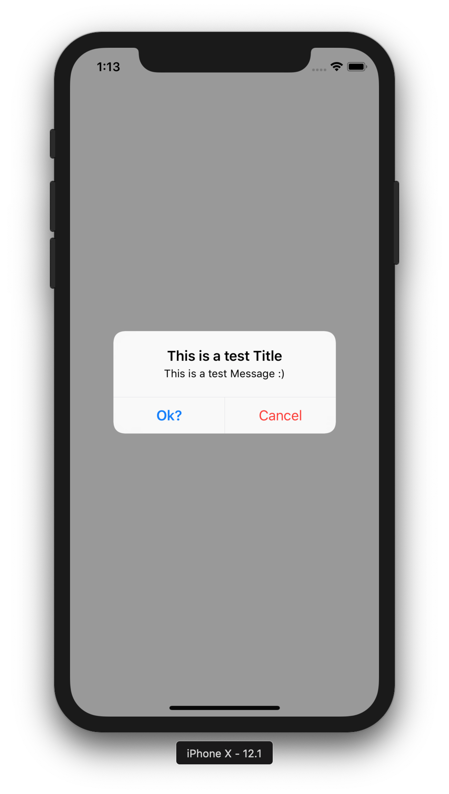

# Simple-Swift-Alert

Just a simple extension for UIViewController to make creating alerts easier.

# How to use

* Add UIViewControllerAlert.swift to your project.
* In your view controller you can call `createBtn` or `showAlert` directly.


# Example

```
let myBtn = createBtn(title: "Ok?", alertStyle: .cancel, completionHandler: { self.test() }) // You can use between .cancel or .default or .destructive 
let myBtn2 = createBtn(title: "Cancel", alertStyle: .destructive, completionHandler: nil)
showAlert("This is a test Title", "This is a test Message :) ", [myBtn, myBtn2])
```

* You can use Clousers to do certain things when the User tabs on any button, and that's by passing the completionHandler parameters which could be nil or a function

```
func test() -> Void{
        print("Yup, the user Tapped me :)")
    }
```


